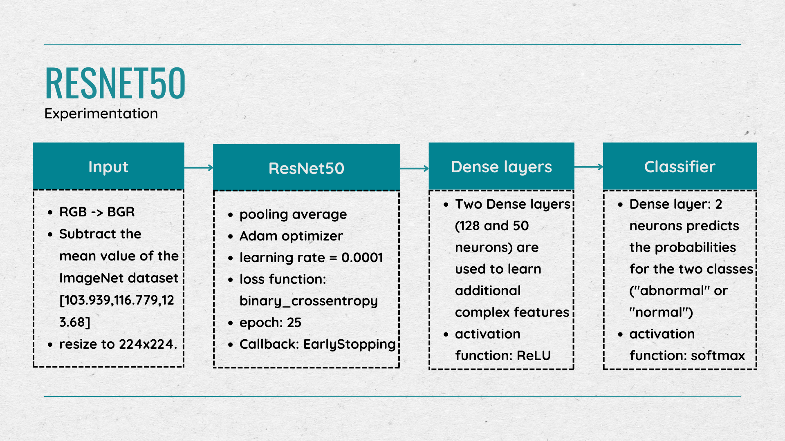

# Abnormal Bone Detection

This project aims to detect abnormalities in bones using medical imaging data. The goal is to classify X-ray images into two categories:
- **Normal**
- **Abnormal**

## Dataset
We used the **MURA (Musculoskeletal Radiographs)** dataset for this project. MURA is a large dataset of musculoskeletal X-rays that contains images labeled as either normal or abnormal.

### Key Features of the Dataset:
- Contains X-ray images from various body parts such as the wrist, elbow, shoulder, etc.
- Binary labels: normal and abnormal.
- Designed for the task of automated abnormality detection in radiographs.

## Problem Statement
The objective is to develop a machine learning model that can accurately classify X-ray images as either normal or abnormal, assisting radiologists in diagnosis and treatment planning.

## Approach
1.**Training**
   

2. **Evaluation**:
   - Accuracy, precision, recall, and F1-score were used as evaluation metrics.
   - Confusion matrix analysis was performed to understand model performance.

## Results
The model achieved satisfactory performance in distinguishing between normal and abnormal X-ray images. Detailed results and performance metrics can be found in the results section of this repository.

## Future Work
- Extend the model to handle multi-class classification for different types of abnormalities.
- Incorporate more datasets to improve robustness and generalization.
- Explore other architectures such as Vision Transformers or hybrid models.

